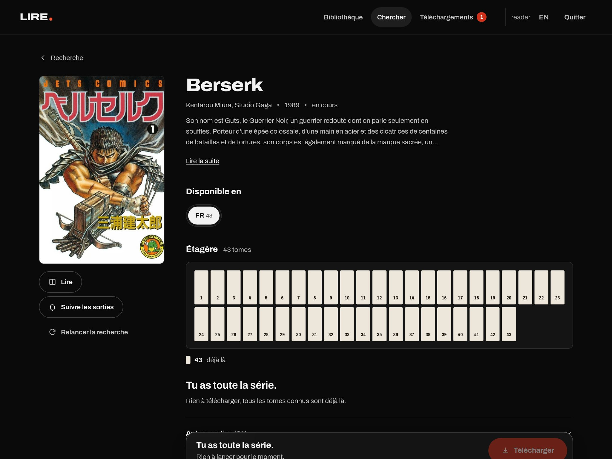
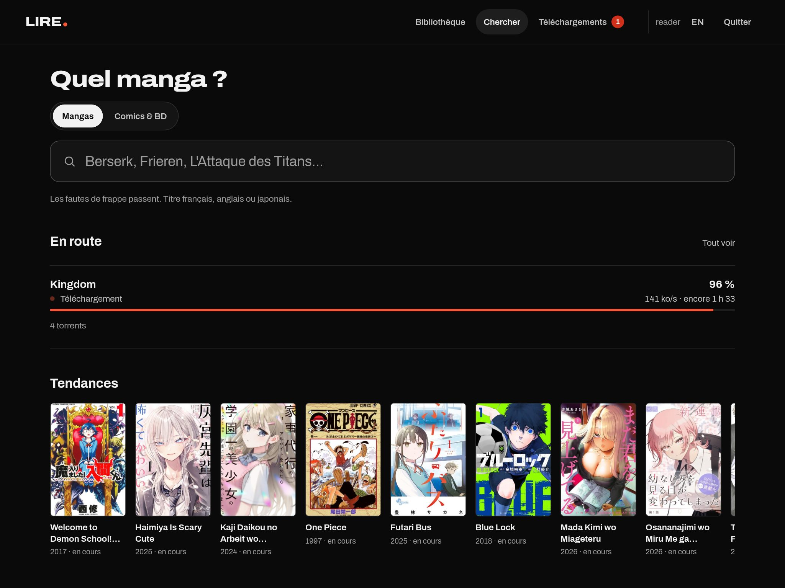
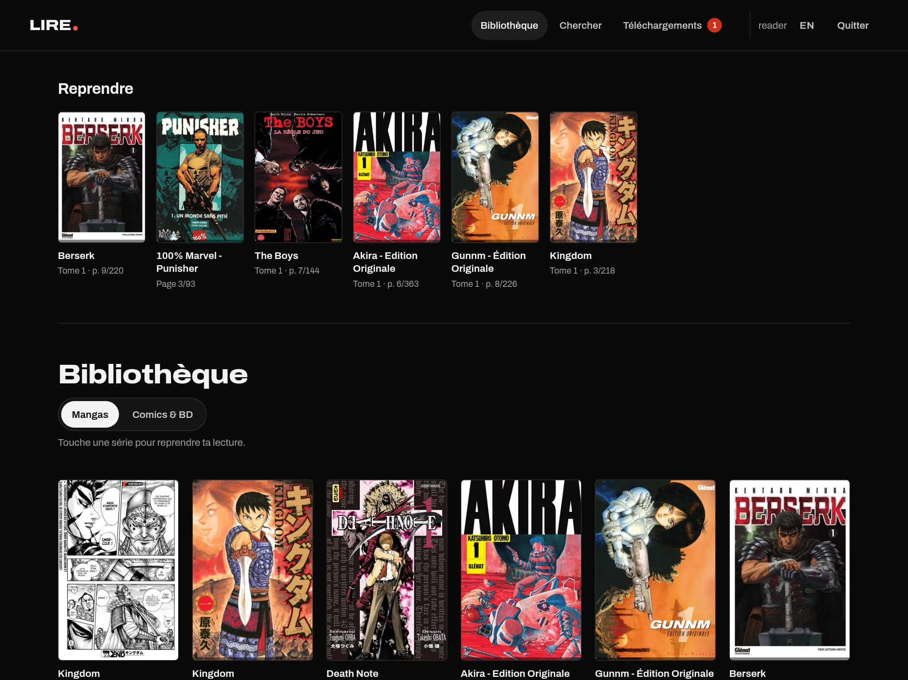
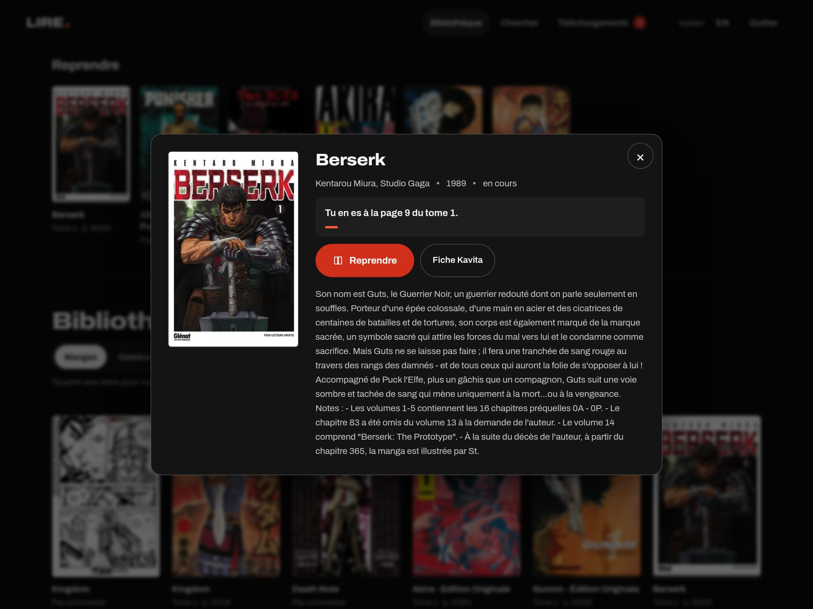
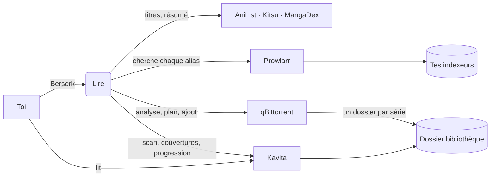

<div align="center">

# Lire.

**Tape le nom d'un manga. Retrouve toute la série sur ton étagère.**

Un « Seerr pour mangas et BD » auto-hébergé : Lire retrouve une série sous tous ses noms, comprend les noms de sorties renvoyés par les indexeurs que tu configures dans Prowlarr, choisit le plus petit ensemble de téléchargements qui couvre tous les tomes, et range le tout directement dans [Kavita](https://www.kavitareader.com/), où tu le lis.

[](https://github.com/Joopinhontas/lire/actions/workflows/ci.yml)
[](LICENSE)
[](https://github.com/Joopinhontas/lire/releases)
[](https://github.com/Joopinhontas/lire/pkgs/container/lire)


[English](README.md) · **Français**



</div>

---

## Pourquoi

Sonarr et Radarr ont rendu les films et les séries ennuyeux, au meilleur sens du terme : on demande une fois, ça arrive. Les livres n'ont jamais eu ça, et pour les mangas c'est pire. Une sortie manga s'appelle par exemple `Berserk (01-41+) (Miura) [Digital]`, les packs chevauchent les tomes à l'unité, les éditions (Perfect, Deluxe, Colossale…) se mélangent à l'édition normale, et aucun *arr n'y comprend rien. On finit par trier des noms de sorties à la main, tome par tome.

Lire fait cette lecture à ta place. Il est pensé pour celles et ceux qui hébergent leur bibliothèque et veulent la série complète, pas une liste de résultats.

## Ce que ça fait

- **Trouve la série, quoi que tu tapes.** AniList pour la fiche de référence, Kitsu pour rattraper les fautes de frappe, MangaDex pour les titres et les résumés en français.
- **Comprend les noms de sorties manga.** Un parseur testé transforme les titres en ensembles de tomes (`T01-T41`, `(01-41+)`, `Tome 12 + 3HS`, listes, décomptes), repère les éditions et écarte chapitres, artbooks, autres langues et formats illisibles, en expliquant pourquoi.
- **Planifie le téléchargement complet le moins cher.** Une couverture d'ensemble pondérée choisit le moins de téléchargements possible, les plus sains (éditions numériques officielles et CBZ d'abord), pour couvrir chaque tome qui te manque.
- **Répond par une étagère.** Tomes déjà là, en route, prévus, introuvables ou sans source se lisent d'un coup d'œil, avant tout texte.
- **Suit les séries en cours.** Touche « Suivre les sorties » : Lire interroge tes indexeurs à intervalle régulier et récupère chaque tome après le dernier que tu as. Un nouveau tome qui n'existe que dans un gros pack t'est signalé au lieu de retélécharger des gigaoctets déjà présents.
- **Ne laisse jamais un téléchargement bloqué.** Un chien de garde remplace les téléchargements qui n'avancent plus par la meilleure sortie disponible couvrant les mêmes tomes.
- **Range tout pour Kavita.** Un dossier par série, scan Kavita déclenché à l'arrivée des fichiers, couvertures manquantes poussées depuis AniList, et un état « Ajout à la bibliothèque » tant que Kavita n'a pas indexé.
- **Reprend là où tu t'es arrêté.** La bibliothèque s'ouvre sur une rangée « Reprendre » (l'On Deck de Kavita, par compte) : un geste et le lecteur s'ouvre à ta page.
- **T'aide à trouver la suivante.** La page de recherche affiche les tendances et les incontournables manga d'AniList, et côté BD une sélection d'incontournables plus les dernières sorties de tes indexeurs.
- **N'importe quel tome, n'importe quelle page.** La fiche liste tous les tomes (lus, en cours, nouveaux) : choisis-en un, glisse jusqu'à la page voulue, le lecteur s'ouvre pile là.
- **Une série, pas deux.** Les sorties livrées en images (un dossier par tome) sont emballées en CBZ à côté des autres tomes, et les bibliothèques Kavita de Lire ignorent les images en vrac : une série n'apparaît jamais en double.
- **Reprend ta lecture.** Les cartes et la fiche affichent « page X du tome N » et ouvrent le lecteur Kavita pile là, pour chaque compte.
- **Mode Comics & BD.** Même parcours pour les comics et la BD franco-belge.
- **Choisis la langue de tes tomes.** Chaque série affiche ce qui existe (« Disponible en FR 43 · EN 41 · JP 12 ») ; ton choix est mémorisé. Chaque langue a son dossier et sa propre bibliothèque Kavita, créée automatiquement, pour que les éditions ne se mélangent jamais.
- **Interface en français et en anglais**, modifiable à tout moment. Les résumés suivent ta langue : français natif depuis MangaDex, anglais depuis AniList, et un LLM local optionnel (Ollama) traduit le reste, avec cache.
- **Des comptes pour les amis.** L'administrateur crée un compte en un geste ; chacun reçoit un compte Kavita jumeau avec le même mot de passe.
- **Pensé pour le canapé.** Une PWA installable conçue sur iPad Pro 13" : cibles tactiles de 48 px, clavier, mouvements réduits, contraste WCAG AA sur fond sombre.

<table>
  <tr>
    <td></td>
    <td></td>
  </tr>
  <tr>
    <td colspan="2"></td>
  </tr>
</table>

## Comment ça marche



1. **Résoudre** la série et rassembler tous ses alias (français, anglais, romaji, synonymes).
2. **Chercher** dans Prowlarr avec les meilleurs alias en parallèle et fusionner les résultats.
3. **Analyser** chaque sortie (`app/parse.py`) : série, édition, format, langue, tomes.
4. **Planifier** (`app/plan.py`) : couverture gloutonne pondérée des tomes manquants, puis élagage des choix redondants ; les numéros de tomes invraisemblables sont plafonnés d'après le nombre connu.
5. **Lancer** : les téléchargements partent dans qBittorrent avec un dossier par série et des tags ; la boucle de scan demande à Kavita d'indexer chaque dossier terminé, et le chien de garde remplace ceux qui bloquent.

## Prérequis

| Brique | Rôle |
| --- | --- |
| Docker + Compose | Fait tourner Lire |
| [Prowlarr](https://prowlarr.com/) | Interroge les indexeurs que tu configures |
| [qBittorrent](https://www.qbittorrent.org/) | Client de téléchargement, interface web activée |
| [Kavita](https://www.kavitareader.com/) 0.8+ | Bibliothèque et lecteur : une bibliothèque mangas, une comics en option |
| [Ollama](https://ollama.com/) (optionnel) | Traduit les résumés disponibles dans une seule langue |

qBittorrent, Kavita et Lire doivent voir les mêmes dossiers : qBittorrent y écrit, Kavita les lit, Lire les monte pour supprimer proprement une série.

## Démarrage rapide

```bash
git clone https://github.com/Joopinhontas/lire.git
cd lire
cp lire.env.example lire.env && chmod 600 lire.env
# renseigne LIRE_PASSWORD, SESSION_SECRET, les URL et clés de Prowlarr / qBittorrent / Kavita
echo "MANGA_DIR=/srv/media/manga"   >> .env    # dossiers de l'hôte partagés avec qBittorrent et Kavita
echo "COMICS_DIR=/srv/media/comics" >> .env
docker compose up -d
```

L'image prête à l'emploi tourne sur amd64 et arm64 (Raspberry Pi, la plupart des NAS). Fige une version avec `LIRE_VERSION=1.0.0` dans `.env`, ou construis depuis les sources avec `docker compose up -d --build`.

Ouvre `http://localhost:8160`, connecte-toi en `admin` avec `LIRE_PASSWORD`, cherche une série.

Pour y accéder d'ailleurs, mets `LIRE_BIND=0.0.0.0:8160` dans `.env` et place Lire derrière ton reverse proxy HTTPS (Lire pose lui-même sa CSP et ses en-têtes de sécurité ; laisse le proxy ajouter HSTS).

### Configuration

Tout se règle dans `lire.env` ; [`lire.env.example`](lire.env.example) documente chaque variable. Les plus utiles :

| Variable | Défaut | Sens |
| --- | --- | --- |
| `KAVITA_LIBRARY` / `KAVITA_COMICS_LIBRARY` | `Mangas` / `Comics & BD` | Noms des bibliothèques Kavita |
| `MANGA_SAVE_ROOT` / `COMICS_SAVE_ROOT` | `/data/manga` / `/data/comics` | Dossiers de destination vus par qBittorrent |
| `KAVITA_MANGA_ROOT` / `KAVITA_COMICS_ROOT` | `/manga` / `/comics` | Les mêmes dossiers vus par Kavita |
| `PROWLARR_CATEGORIES` | `7000` | Catégories interrogées |
| `MANGA_CATEGORIES` / `COMICS_CATEGORIES` | `7030` | Catégories qu'une sortie doit porter pour compter (les ids propres à ton indexeur s'il en a) |
| `KAVITA_PUBLIC_URL` | `KAVITA_URL` | Adresse ouverte par les lecteurs |
| `OLLAMA_URL` | vide | Active la traduction des résumés |

### Plusieurs langues

Le français est la langue par défaut, mais une série peut aussi être récupérée en anglais, japonais (raw), espagnol, italien ou allemand. Lire lit les tags de langue dans les titres ; pour les indexeurs dont les sorties n'en ont pas, déclare leur langue avec `INDEXER_LANGS=5:en` (ids d'indexeurs Prowlarr) ou `CATEGORY_LANGS` (ids de catégories). Les autres langues vont dans `manga-lang/<code>` à côté de ton dossier manga : monte-le dans Kavita en `/manga-lang` (et `comics-lang` en `/comics-lang`), Lire crée « Mangas EN », « Mangas JP »… à la première utilisation et les ouvre à tous les comptes.

### Kavita dans Lire (optionnel, idéal sur iPad)

Si Kavita tourne avec l'URL de base `/kavita/` et que ton proxy le sert sous le domaine de Lire, renseigne `PUBLIC_URL` : Lire ouvre alors le lecteur dans la même app installée au lieu d'un nouvel onglet.

```nginx
location /kavita/ {
    proxy_pass http://kavita:5000;
    proxy_set_header Host $host;
    proxy_http_version 1.1;
    proxy_set_header Upgrade $http_upgrade;
    proxy_set_header Connection "upgrade";
}
```

### Connexion unique (SSO)

Lire et Kavita peuvent partager une seule connexion via n'importe quel fournisseur OpenID Connect (Pocket ID avec passkeys convient très bien à un serveur maison) :

1. Dans le fournisseur, crée deux clients : Lire, avec l'URL de retour `<PUBLIC_URL>/api/auth/oidc/callback`, et Kavita, avec `<URL de Kavita>/signin-oidc`.
2. Renseigne `OIDC_ISSUER`, `OIDC_CLIENT_ID`, `OIDC_CLIENT_SECRET` et `OIDC_NAME` dans `lire.env`.
3. Active OpenID Connect dans Kavita (paramètres admin) avec le même fournisseur ; Kavita rattache les comptes existants par e-mail, donc donne à chacun la même adresse des deux côtés.

Les comptes à mot de passe continuent de fonctionner. Une personne connue du fournisseur obtient un compte Lire à sa première connexion. Quand Kavita est servi sous le domaine de Lire, Lire relie la progression de lecture de chacun automatiquement à la première ouverture de Kavita.

### Sur iPad

Ouvre Lire dans Safari, touche Partager puis **Sur l'écran d'accueil**. L'app tourne en plein écran, et Kavita s'ouvre dedans quand la location ci-dessus est en place.

## Sécurité

- Sessions : cookie `__Host-` signé HMAC, `HttpOnly`, `SameSite=Lax`, révoqué à chaque changement de mot de passe.
- Mots de passe hachés en scrypt ; connexion limitée par IP et par identifiant, comparaisons à temps constant.
- En-tête anti-CSRF sur toute écriture, routes réservées à l'admin, limites de débit par compte sur les recherches.
- CSP stricte, COOP, CORP, `Permissions-Policy`, `no-referrer`.
- Conteneur : racine en lecture seule, toutes les capabilities retirées, `no-new-privileges`, utilisateur non privilégié, dépendances figées et auditées.

Une faille ? Ouvre une [alerte de sécurité privée](https://github.com/Joopinhontas/lire/security/advisories/new) plutôt qu'une issue.

## Développement

```bash
python3 -m venv .venv && . .venv/bin/activate
pip install -r requirements.txt pytest
pytest -q
```

Les tests tournent sur des noms de sorties réalistes (`tests/fixtures`). Quand un titre est mal compris, ajoute-le d'abord dans `tests/test_parse.py`, puis corrige le parseur. Le front est en modules ES natifs dans `app/static`, sans build ; les textes de l'interface vivent dans `app/static/i18n.js` et doivent exister dans les deux langues. Les principes de design sont dans [`docs/DESIGN.md`](docs/DESIGN.md).

## Feuille de route

La suite se suit dans les [issues](https://github.com/Joopinhontas/lire/issues) : davantage de fixtures de sorties anglaises, support de Komga, notifications quand une série arrive, et métadonnées poussées dans Kavita. Idées et questions sont les bienvenues dans les [Discussions](https://github.com/Joopinhontas/lire/discussions).

Si Lire t'épargne une soirée à trier des tomes à la main, une étoile aide d'autres lecteurs à le trouver.

## Usage responsable

Lire est un gestionnaire de bibliothèque. Il n'héberge aucun contenu, n'embarque aucun indexeur et ne pointe vers aucune source : il ne parle qu'aux services que tu configures toi-même. Tu es responsable de l'utiliser avec des sources et des contenus auxquels tu as le droit d'accéder selon les lois qui s'appliquent à toi. Soutiens les auteurs et les éditeurs que tu aimes, et achète les livres que tu aimes.

## Licence

[PolyForm Noncommercial 1.0.0](LICENSE). Libre d'utiliser, d'étudier, de modifier et de partager pour tout usage non commercial : usage personnel, projets perso, recherche, enseignement, associations, institutions publiques. Le vendre, le proposer en service payant ou l'intégrer à un produit commercial demande une licence à part : ouvre une issue pour en parler.

C'est une licence « source disponible », pas une licence open source approuvée par l'OSI. C'est voulu : le projet reste un cadeau fait aux lecteurs, pas une matière première pour le service payant de quelqu'un d'autre.
