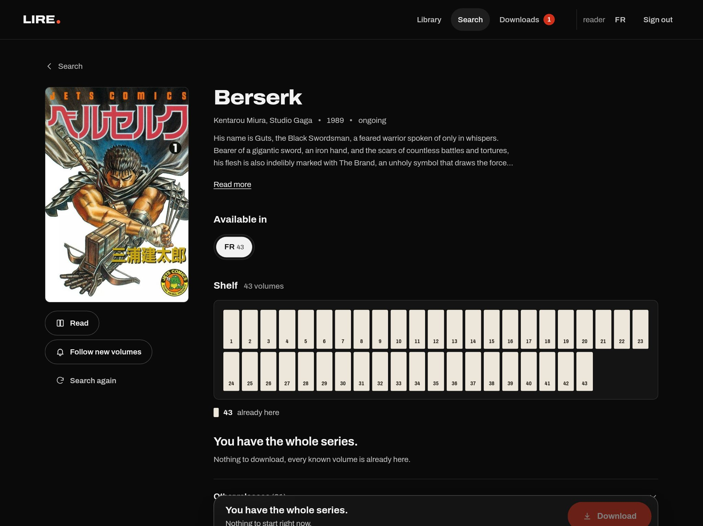
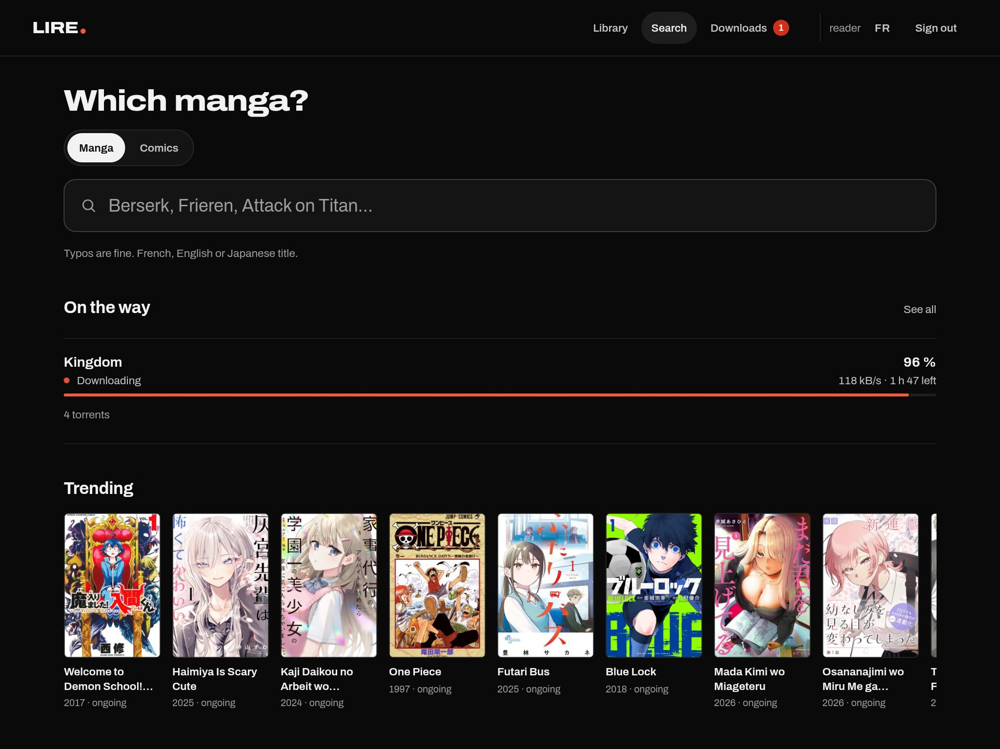
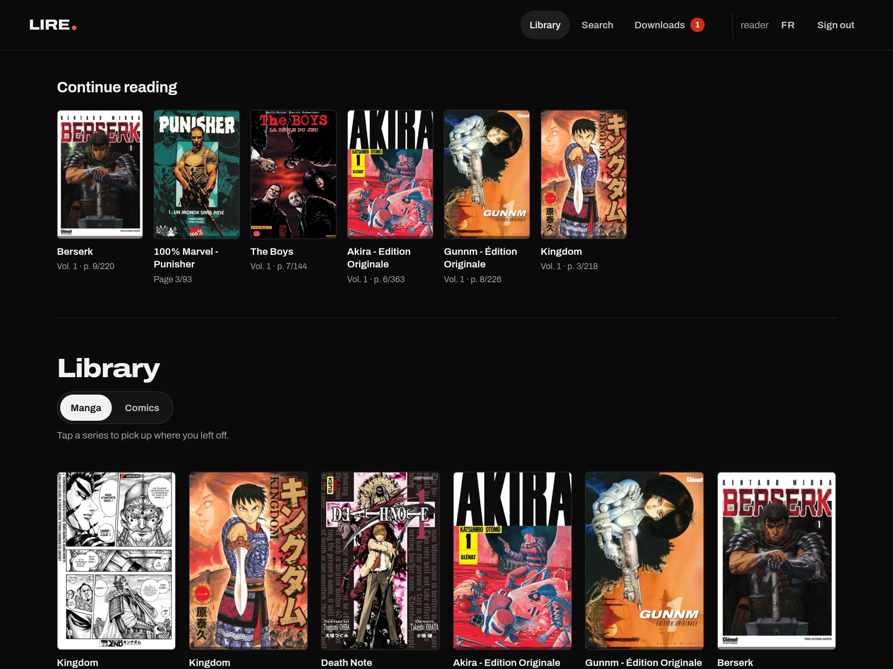
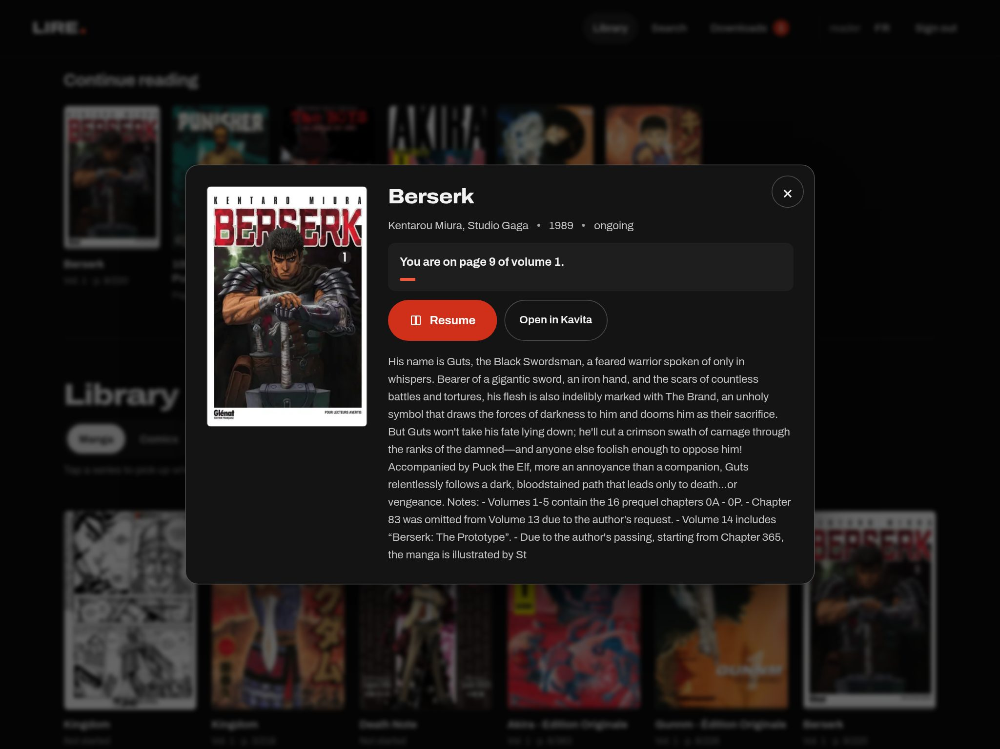
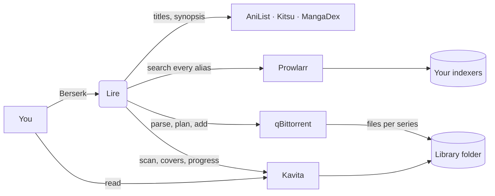

<div align="center">

# Lire.

**Type a manga's name. Get the whole series on your shelf.**

A self-hosted "Seerr for manga and comics": Lire finds a series under all its names, understands the release names returned by the indexers you configure in Prowlarr, picks the smallest set of downloads that covers every volume, and files the result straight into [Kavita](https://www.kavitareader.com/), where you read it.

[](https://github.com/Joopinhontas/lire/actions/workflows/ci.yml)
[](LICENSE)
[](https://github.com/Joopinhontas/lire/releases)
[](https://github.com/Joopinhontas/lire/pkgs/container/lire)


**English** · [Français](README.fr.md)



</div>

---

## Why

Sonarr and Radarr made films and TV boring in the best way: ask once, it shows up. Books never got that, and manga is worse. A manga release is named something like `Berserk (01-41+) (Miura) [Digital]`, packs overlap single volumes, editions (Perfect, Deluxe, Colossale…) mix with the regular run, and no *arr understands any of it. So you end up reading release names by hand, volume by volume.

Lire does that reading for you. It is built for people who self-host their library and want the whole series, not a list of search results.

## What it does

- **Finds the series, whatever you type.** AniList for the canonical record, Kitsu to recover from typos, MangaDex for French titles and French synopses.
- **Understands manga release names.** A tested parser turns titles into volume sets (`T01-T41`, `(01-41+)`, `Tome 12 + 3HS`, lists, counts), spots editions, and leaves out chapters, art books, other languages and unreadable formats, telling you why.
- **Plans the cheapest complete download.** A weighted set cover picks the fewest, healthiest releases (official digital editions and CBZ first) that cover every volume you do not own yet.
- **Shows the answer as a shelf.** Owned, on the way, planned, missing and dead volumes read at a glance, before any text.
- **Follows ongoing series.** Tap "Follow new volumes" and Lire checks your indexers on a schedule, grabbing every volume after the last one you have. A new volume that only exists inside a big pack is flagged for you instead of pulling gigabytes you already own.
- **Never leaves a download stuck.** A watchdog replaces downloads that stop moving with the best available release covering the same volumes.
- **Files everything for Kavita.** One folder per series, Kavita scan triggered when files land, missing covers pushed from AniList, and an "Adding to the library" state until Kavita has indexed it.
- **Picks up where you left off.** The library opens on a "Continue reading" row (Kavita's On Deck, per account): one tap and the reader opens at your page.
- **Helps you find the next one.** The search page shows trending and all-time favourite manga from AniList, and for comics a curated list of essentials plus the latest releases on your indexers.
- **Any volume, any page.** The detail sheet lists every volume (read, in progress, new): pick one, slide to a page, and the reader opens right there.
- **One series, not two.** Releases shipped as loose images (one folder per volume) are packed into CBZ next to the other volumes, and Lire's Kavita libraries skip loose images, so a series never shows up twice.
- **Resumes your reading.** Library cards and the detail sheet show "page X of volume N" and open Kavita's reader right there, per account.
- **Comics and BD mode.** Same flow for comics and Franco-Belgian albums.
- **Pick the language of your volumes.** Each series shows what exists ("Available in FR 43 · EN 41 · JP 12"); your choice is remembered. Every language gets its own folder and its own Kavita library, created automatically, so editions never mix.
- **French and English interface**, switchable at any time. Synopses come in your language: native French from MangaDex, English from AniList, and an optional local LLM (Ollama) translates the rest, cached.
- **Accounts for friends.** The admin creates accounts in one tap; each one gets a twin Kavita account with the same password.
- **Made for the couch.** An installable PWA designed on an iPad Pro 13": 48 px touch targets, keyboard support, reduced motion, WCAG AA contrast on a dark surface.

<table>
  <tr>
    <td></td>
    <td></td>
  </tr>
  <tr>
    <td colspan="2"></td>
  </tr>
</table>

## How it works



1. **Resolve** the series and gather every alias (French, English, romaji, synonyms).
2. **Search** Prowlarr with the best few aliases in parallel and merge the results.
3. **Parse** each release (`app/parse.py`): series match, edition, format, language, volumes.
4. **Plan** (`app/plan.py`): weighted greedy cover of the missing volumes, then prune redundant picks; implausible volume numbers are capped against the known count.
5. **Grab**: downloads go to qBittorrent with a per-series save path and tags; the scanner loop asks Kavita to scan each finished folder, and the watchdog swaps stalled downloads.

## Requirements

| Piece | Role |
| --- | --- |
| Docker + Compose | Runs Lire |
| [Prowlarr](https://prowlarr.com/) | Searches the indexers you configure |
| [qBittorrent](https://www.qbittorrent.org/) | Download client, Web UI enabled |
| [Kavita](https://www.kavitareader.com/) 0.8+ | Library and reader: one library for manga, optionally one for comics |
| [Ollama](https://ollama.com/) (optional) | Translates synopses that exist in only one language |

qBittorrent, Kavita and Lire must see the same folders: qBittorrent writes to them, Kavita reads them, Lire mounts them to delete series cleanly.

## Quick start

```bash
git clone https://github.com/Joopinhontas/lire.git
cd lire
cp lire.env.example lire.env && chmod 600 lire.env
# fill in LIRE_PASSWORD, SESSION_SECRET, the Prowlarr / qBittorrent / Kavita URLs and keys
echo "MANGA_DIR=/srv/media/manga"   >> .env    # host folders shared with qBittorrent and Kavita
echo "COMICS_DIR=/srv/media/comics" >> .env
docker compose up -d
```

The prebuilt image runs on amd64 and arm64 (Raspberry Pi, most NAS). Pin a version with `LIRE_VERSION=1.0.0` in `.env`, or build from source with `docker compose up -d --build`.

Open `http://localhost:8160`, sign in as `admin` with `LIRE_PASSWORD`, search for a series.

To reach it from elsewhere, set `LIRE_BIND=0.0.0.0:8160` in `.env` and put it behind your HTTPS reverse proxy (Lire sets its own CSP and security headers; let the proxy add HSTS).

### Configuration

Everything lives in `lire.env`; [`lire.env.example`](lire.env.example) documents each variable. The ones people usually touch:

| Variable | Default | Meaning |
| --- | --- | --- |
| `KAVITA_LIBRARY` / `KAVITA_COMICS_LIBRARY` | `Mangas` / `Comics & BD` | Kavita library names |
| `MANGA_SAVE_ROOT` / `COMICS_SAVE_ROOT` | `/data/manga` / `/data/comics` | Save folders as qBittorrent sees them |
| `KAVITA_MANGA_ROOT` / `KAVITA_COMICS_ROOT` | `/manga` / `/comics` | The same folders as Kavita sees them |
| `PROWLARR_CATEGORIES` | `7000` | Categories searched |
| `MANGA_CATEGORIES` / `COMICS_CATEGORIES` | `7030` | Categories a release must carry to count (your indexer's own ids if it has dedicated ones) |
| `KAVITA_PUBLIC_URL` | `KAVITA_URL` | Address readers open |
| `OLLAMA_URL` | empty | Enables synopsis translation |

### More than one language

French is the default, but a series can be fetched in English, Japanese (raw), Spanish, Italian or German too. Lire reads language tags in release titles; for indexers whose releases carry no tag, declare their language with `INDEXER_LANGS=5:en` (Prowlarr indexer ids) or `CATEGORY_LANGS` (category ids). Non-default languages go to `manga-lang/<code>` next to your manga folder: mount it in Kavita as `/manga-lang` (and `comics-lang` as `/comics-lang`) and Lire creates "Mangas EN", "Mangas JP"… on first use and opens them to every account.

### Kavita inside Lire (optional, nice on iPad)

If Kavita runs with the base URL `/kavita/` and your proxy serves it under Lire's own host, set `PUBLIC_URL` and Lire opens the reader in the same installed app instead of a new tab:

```nginx
location /kavita/ {
    proxy_pass http://kavita:5000;
    proxy_set_header Host $host;
    proxy_http_version 1.1;
    proxy_set_header Upgrade $http_upgrade;
    proxy_set_header Connection "upgrade";
}
```

### Single sign-on

Lire and Kavita can share one login through any OpenID Connect provider (Pocket ID with passkeys works well for a home server):

1. In the provider, create two clients: Lire, with the callback `<PUBLIC_URL>/api/auth/oidc/callback`, and Kavita, with `<Kavita URL>/signin-oidc`.
2. Set `OIDC_ISSUER`, `OIDC_CLIENT_ID`, `OIDC_CLIENT_SECRET` and `OIDC_NAME` in `lire.env`.
3. Enable OpenID Connect in Kavita (Admin settings), with the same provider; Kavita links existing accounts by email, so give each person the same email in both.

Password accounts keep working. People known to the provider get a Lire account on their first sign-in. When Kavita is served under Lire's domain, Lire links each reader's progress automatically the first time they open Kavita.

### On an iPad

Open Lire in Safari, tap Share, then **Add to Home Screen**. It runs full screen like an app, and Kavita opens inside it when the location above is set.

## Security

- Sessions: HMAC signed `__Host-` cookie, `HttpOnly`, `SameSite=Lax`, revoked on password reset.
- Passwords hashed with scrypt; login throttled per IP and per username, with constant time checks.
- CSRF header on every write, admin only routes, per user rate limits on searches.
- Strict CSP, COOP, CORP, `Permissions-Policy`, `no-referrer`.
- Container: read-only root, every capability dropped, `no-new-privileges`, unprivileged user, pinned and audited dependencies.

Found a vulnerability? Open a private [security advisory](https://github.com/Joopinhontas/lire/security/advisories/new) rather than an issue.

## Development

```bash
python3 -m venv .venv && . .venv/bin/activate
pip install -r requirements.txt pytest
pytest -q
```

The test suite runs on realistic release names (`tests/fixtures`). When a title is parsed wrong, add it to `tests/test_parse.py` first, then fix the parser. The frontend is plain ES modules in `app/static`, no build step; interface strings live in `app/static/i18n.js` and must exist in both languages. Design principles are in [`docs/DESIGN.md`](docs/DESIGN.md).

## Roadmap

What comes next is tracked in [issues](https://github.com/Joopinhontas/lire/issues): more English release fixtures, Komga support, notifications when a series lands, and metadata pushed into Kavita. Ideas and questions are welcome in [Discussions](https://github.com/Joopinhontas/lire/discussions).

If Lire saves you an evening of sorting volumes by hand, a star helps other readers find it.

## Responsible use

Lire is a library manager. It hosts no content, ships with no indexer and points to no source: it only talks to the services you configure yourself. You are responsible for using it with sources and content you have the right to access under the laws that apply to you. Please support the authors and publishers whose work you enjoy, and buy the books you love.

## License

[PolyForm Noncommercial 1.0.0](LICENSE). Free to use, study, modify and share for any noncommercial purpose: personal use, hobby projects, research, education, charities, public institutions. Selling it, hosting it as a paid service or using it inside a commercial product requires a separate license: open an issue to ask.

This is a source-available license, not an OSI-approved open source one. That is deliberate: the project stays a gift to readers rather than raw material for someone else's paid service.
